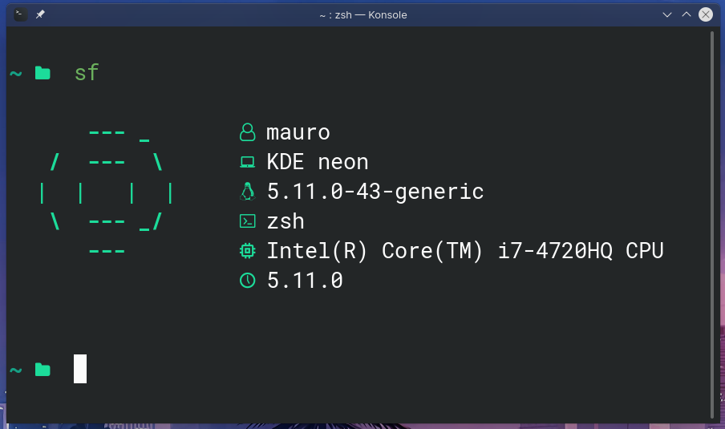

<h1 align="center"> sf </h1>
<p align="center"> A small system information fetcher. </p>

### What is sf?

sf (Small fetcher) is a distribution system fectcher for UNIX-like operating systems. It is very small and the idea was to make it in less than `400` lines. It is very customizable and it works well for linux ricing.

### Prequisites

* `/etc/os-release` file.
* `UNIX-like` OS

### Instalation

To install sf, curl the instalation script and run it with bash.

**note**: it will use `sudo` so that the shell script can be in `/bin/sf`.

```
curl -fsSL https://raw.githubusercontent.com/mauro-balades/sf/main/install.sh | sh
```

### Help

To get a help section, just type the following command in your terminal.

```
man sf
```

### Screenshot

This is an screenshot from a KDE linux user.



#### License

* `Small fetcher` is under the license of [MIT](./LICENSE)